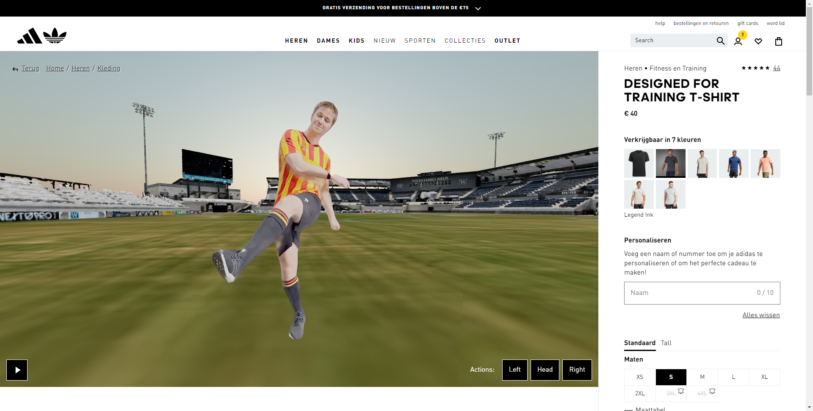

# Getting Started

First, install the necessary packages:

```bash
npm i
```

Then, run the development server:

```bash
npm run dev
```

Open [http://localhost:3000](http://localhost:3000) with your browser to see the result.

You can start editing the Virtual Wardrobe component by modifying `src/components/VirtualWardrobe/index.js`.

The page auto-updates as you edit the file.

# Introduction

In this document, I will present and handover the prototype for my test plan for demonstrating the conversion rate of my concept, the Adidas Sporty Tryouts. This concept involves embedding a short video game on the Adidas e-commerce website, allowing customers to virtually try out different clothing items in various scenarios with their selected Adidas virtual ambassador. This interactive and engaging experience offers users rewards after finishing a game, aiming to increase engagement and satisfaction. Each clothing section is paired with specific game scenarios, such as football, basketball, or tennis.

Before proceeding with production, it is imperative to validate the commercial potential of this concept by showcasing its conversion rate. Assessing the application's conversion rate is a critical initial step before committing to any definitive investment and moving forward with execution. This evaluation serves the dual purpose of confirming the idea's viability and, more importantly, mitigating potential financial risks associated with any definitive investment and execution.

To evaluate the conversion rates for Adidas Sporty Tryouts, I have chosen to conduct an A/B test, following consideration of alternative methods like preference tests and surveys, which focus on user preferences and emotional responses to design. The A/B test stands out because it provides tangible, quantifiable performance metrics based on actual user interactions.

To execute this test, a direct comparison needs to be performed between the current Adidas website and the one featuring the virtual tryout feature. This approach involves dividing website visitors into two groups: the test group, which gains access to the virtual tryout feature, and the control group, which does not. This division allows for an objective assessment of the two groups' performance and an accurate determination of the impact of the virtual tryout feature on conversion rates.

As outlined in my Conversion Test Plan for Adidas Sporty Tryouts, I suggest a one-month test duration. It's crucial to sync this timeframe with Adidas' product-development cycles to prevent any interference from concurrent changes. Additionally, I recommend using Optimizely for the test since it's already familiar to Adidas and provides robust developer documentation.

To confirm the virtual tryout feature's impact on conversion, the conditions are an increased sales compared to the current version and higher user interaction with the virtual wardrobe before making a purchase, in comparison to users who didn't use this feature.

# The Prototype

To conduct the A/B test effectively, it is essential to create a website version incorporating the virtual tryout feature. With my prototype, I provide GroupM with a simulation of the existing Adidas product page, seamlessly integrated with the new feature. Initially, the focus is solely on the virtual wardrobe feature for the first iteration and excludes the game component from the initial concept. This incremental approach, introducing one feature at a time, enables for drawing distinct conclusions for each feature's impact.

A brief analysis of the current Adidas website reveals that it utilises React, a widely adopted open-source front-end JavaScript library for creating user interfaces based on components, maintained by Meta. To ensure seamless integration with their existing technology stack, I opted for Next.js, which builds upon React and serves as a comprehensive web development framework capable of managing both front-end and back-end aspects. This choice simplifies the handling of files like 3D objects and holograms.

One key advantage of React components is their adaptability across different frameworks, adding to the versatility of this solution. Furthermore, this prototype incorporates a mobile-based volumetric capture due to the absence of a high-end capture studio. Once such high-end capabilities become available, a new component can be seamlessly integrated. Mobile-based captures offer the advantage of rapid prototyping, which can be a valuable resource for the Adidas team.

For this project, I've prepared two applications: one containing the necessary React code for integration into the Adidas repository and another illustrating how the feature would appear on the live website in the form of a demo. This approach allows for a smooth transition from prototype to implementation, streamlining the development process. Below the sources to these applications:

**Live demo**: [https://s8-edu-adidas-virtual-wardrobe-demo.netlify.app/](https://s8-edu-adidas-virtual-wardrobe-demo.netlify.app/)

Application repository: [https://github.com/jancarlohendriks/s8-edu-adidas-virtual-wardrobe](https://github.com/jancarlohendriks/s8-edu-adidas-virtual-wardrobe)

Demo repository: [https://github.com/jancarlohendriks/s8-edu-adidas-virtual-wardrobe--demo](https://github.com/jancarlohendriks/s8-edu-adidas-virtual-wardrobe--demo)

## Features



In both the React application and the demo the following features can be found:

- 3D scene including the hologram, football club stadium and the sky
- Play/Pause control
- Actions control for hologram (hit the ball with left foot, head or right foot)
- 3D scene scales according to size of browser, also on mobile (responsive)

## Code Explanation

The component that handles the virtual wardrobe feature is called “VirtualWardobe”, which is a folder containing the React code and its styling. It can be imported into any other React component as follow:

```jsx
import VirtualWardobe from "FOLDER/TO/COMPONENTS/VirtualWardrobe";
```

It can be used as follow:

```jsx
<VirtualWardobe />
```

### 3D scene

For compositing the 3D scene with different assets I use a library called Three.js ([https://github.com/mrdoob/three.js](https://github.com/mrdoob/three.js)). This is the standard 3D library used in the industry for creating 3D web projects. Basic elements to get the 3D scene started:

```jsx
// Create a scene, camera, and renderer
const renderer = new THREE.WebGLRenderer();
const scene = new THREE.Scene();
const camera = new THREE.PerspectiveCamera(75, 1, 0.1, 1000);
const controls = new OrbitControls(camera, renderer.domElement);
```

### Hologram

For the holograms I use the library volograms-js ([https://github.com/remmel/volograms-js](https://github.com/remmel/volograms-js)). This library allows me to load the holograms made by mobile with the app Volu ([https://www.volograms.com/](https://www.volograms.com/)).

To load an hologram:

```jsx
let vologram = new Vologram("FOLDER/TO/VOLOGRAM");
// Example folder name = "1690983019490_ld"
```

This lib uses and exposes the standard HTMLVideoElement; most common methods are:

```jsx
//Pause
vologram.elVideo.pause();
//Play
vologram.elVideo.play();
// Mute/unmute
vologram.elVideo.muted = false;
// Seek
vologram.elVideo.currentTime = 1.5; // Seconds
```

### Stadium

The stadium is a 3D model exported as .glb file. To load any .glb or .gltf model the following code can be used:

```jsx
// Function to load the GLTF model
function loadModel() {
  window.createImageBitmap = undefined; // Clear cache
  const loader = new GLTFLoader();
  loader.load("assets/stadium.glb", (gltf) => {
    const model = gltf.scene; // Model
    model.scale.set(1, 1, 1); // Scale
    model.position.set(7, 10.05, -8); // Position
    model.rotateY(-91); // Rotation
    scene.add(model); // Adds Stadium to the 3D scene
  });
}
```

### Sky

To create the sky, I decided to use an external library because it allows for easy modification without having to search for external assets which in turn saves a lot of time. The library is called Three Sky ([https://github.com/loginov-rocks/three-sky](https://github.com/loginov-rocks/three-sky)).

```jsx
// Function to initialize the sky
function initSky() {
  const sky = new Sky();
  sky.scale.setScalar(450000);
  scene.add(sky); // Adds the sky to the 3D scene
}
```

# Conclusion

I've supplied the code and documentation necessary to conduct the A/B test for integrating the new virtual wardrobe feature into the Adidas website. This contribution will assist GroupM in effectively measuring the conversion rates of Adidas Sporty Tryouts.

Regarding the technology choice, I've selected Next.js due to its compatibility with the current Adidas website, which is built on React. Next.js extends React's capabilities, serving as a comprehensive web development framework capable of managing both front-end and back-end components. This choice streamlines the handling of files like 3D objects and holograms. In addition, the adaptability of React components across different frameworks enhances the overall versatility of this solution.

# Recommendation

The next crucial step is the integration of this prototype into the Adidas website. The development team will need to tailor the React code to meet their specific requirements, although my prototype lays a solid foundation that is easily adaptable to incorporate new assets. However, it's important to note that the assets I've provided are of low quality and should not be used in a production environment.

Furthermore, it's imperative that any changes made to the actual Adidas website align with this prototype to ensure a seamless A/B test that isn't influenced by external factors, such as concurrent product changes.

In terms of running the A/B test, I assessed several tools and determined that Optimizely, which Adidas already uses, is an effective choice. The development team can seamlessly integrate this new prototype into their Optimizely environment to initiate the A/B test.

Before commencing the A/B test, the development team should establish a specific test period. As outlined in my test plan, a one-month duration strikes a balance between being long enough to capture sufficient baseline user data and conversion events, and short enough to make a timely impact on business decisions. However, it's crucial that this test period aligns with the product-development cycles of the Adidas team. This synchronisation is vital to avoid any unintended influence from additional changes made beyond those introduced during the virtual tryout cycle, ensuring that the conclusions drawn are not confounded by other variables.
